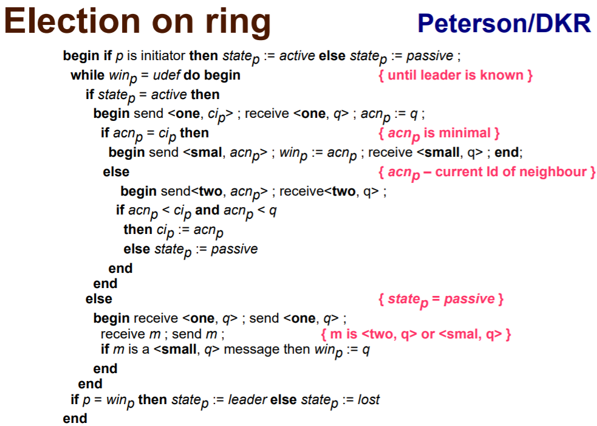

# Semestrální práce DSV - "ChatApp"

## Stručný popis zadání
Program umožnující zasílání zpráv mezi jednotlivými uzly. Zprávy bude vždy možné v rámci celého systému úplně uspořádat (k synchronizaci použijte buď 'vůdce' nebo výlučný přístup v rámci celého systému). Jednotlivé uzly budou implementovat minimálně tyto funkce: pošli/přijmi zprávu, odhlaš se ze systému, skonči bez odhlášení, přihlaš se do systému.

## Popis semestrální práce

**"ChatApp"** - aplikace umožnující chatování mezi dvěma a více uzly. 

- **Předmět:** DSV - Distribuované systémy a výpočty
- **Zadání:** Chatovací program
- **Typ problému:** Volba vůdce (rozbití symetrie)
- **Implementovaný algoritmus:** Peterson
- **Programovací jazyk a technologie:** Node.js, WebSockets - Socket.IO

### Struktura projektu

src
- cli.js
- client.js
- index.js
- node.js
- server.js
- utils.js 

## Spuštění aplikace

### Instalace

Nejprve je třeba nainstalovat Node.js v14.x. Pokud jste jej již nainstalovali, můžete přeskočit kroky 1 a 2.

1. Instalace curl:
```
sudo apt update
sudo apt install curl
```

2. Instalace nodejs:
```
curl -sL https://deb.nodesource.com/setup_14.x | sudo -E bash -
sudo apt-get install -y nodejs
```

3. Instalace projektu:
```
git clone https://gitlab.fel.cvut.cz/momotari/dsv_chat.git
cd dsv_chat
npm install
```

### Spuštění

Příklad:
```
npm run client1
```
Pro spuštění více uzlů, stačí změnit číslo na 2 - 5.

## Příkazy

- ```listen``` - uzel poslouchá a očekává připojení dalších uzlů.
- ```connect``` - umožňuje připojení uzlu k síti.
- ```status``` - zobrazuje současný stav uzlu v síti(id, name, left(client), ...).
- ```name``` - příkaz pro změnu jména uzlu.
- ```message``` - příkaz pro psaní zprávy.
- ```messages``` - příkaz pro zobrazení všech zpráv do konzoly.
- ```export messages``` - příkaz pro export všech zpráv uzlu do txt souboru.
- ```logs``` - umožňuje vypsat do konzoly všechny logy, které existují až do tohoto okamžiku.
- ```export logs``` - příkaz pro export všech logů uzlu do txt souboru.
- ```exit``` - dobrovolné odhlášení ze sítě.

## Připojení

Pro připojení je potřeba zadat do příkazového řádku příkaz ```connect``` a pak PORT jiného samostatného uzlu. Topologie sítě je kruhová. Každý nový uzel se bude snažit vstoupit do kruhu.

## Oprava sítě

Oprava sítě probíhá automaticky, když ji někdo opustí nebo se k ní připojí.

## Zprávy

### Odesílání zpráv

Pro odesílání zprávy je potřeba zadat do příkazového řádku příkaz ```message```. Pak musíte zadat zprávu, kterou chcete odeslat a stisknout Enter.

Zpráva bude odeslána pouze dalšímu uzlu. Když jej další uzel obdrží, zkontroluje, zda již byla schválena. Pokud ne, pak uzel předá zprávu dál, dokud nedosáhne vůdce a bude jim schválena. Zprávu může schválit pouze vůdce. Pokud je uzel, který zprávu obdrží, vůdce, měl by ji schválit a dát razítko obsahující, kdy to udělal. Pokud bude zjištěno, že zpráva nebyla schválena, to znamená, že vůdce neexistuje. To je okamžik, kdy začnou volby.
Po schválení vůdcím bude zpráva zobrazena všemi uzly.

Ukončení režimu odesílání zpráv je možné zasláním prázdné zprávy.

### Export zpráv

Pro export všech zpráv je potřeba zadat do příkazového řádku příkaz ```messages``` a všechny zprávy z tohoto uzlu budou zobrazeny v konzole.

## Kruhová topologie

V kruhové topologii se každý uzel pouze připojuje do jeho dvou sousedních uzlů. Tyto spojení mohou vytvořit obousměrné nebo jednosměrné komunikace mezi dvěma připojenými sousedními uzly v kruhu. Kruhová topologie umožňuje
uzly, aby měly synchronní nebo asynchronní komunikaci. V synchronním kruhu každý uzel může posílat zprávu svým sousedům pouze v určitých předdefinovaných synchronních časových událostech (hodiny), zatímco v asynchronním kruhu může každý uzel poslat svou zprávu v libovolném náhodném čase, kdy se bude připraven k odeslání zprávy do sousedních uzlů v kruhu.

Petersonův algoritmus pracuje na **jednosměrném asynchronním kruhu**. Algoritmus efektivně řeší problém volby vudcu v nejznámějším pořadí, které předává pouze zprávu O(nlog(n)) po síti.

## Popis algoritmu Peterson

Petersonův algoritmus předpokládá, že každý uzel v kruhové síti má jedinečné identifikační číslo (UID) a může být v aktivním nebo pasivním stavu. Petersonův algoritmus také předpokládá, že v každém uzlu sítě existuje fronta FIFO, což každému uzlu umožňuje kdykoli posílat zprávy související s volbami vůdce do sousedních uzlů.

Když algoritmus začne fungovat, všechny uzly budou inicializovány a budou v aktivním režimu. Každý uzel má virtuální ID(сip), který je iniciován na UID uzlu na začátku provádění. V aktivním režimu každý uzel posílá svůj aktuální virtuální ID dalšímu uzlu (první zpráva) a čeká, až také obdrží od sousedního (předchozího) uzlu první zprávu s jeho ID(acnp). Pak porovná ID ze přijaté zprávy se svým aktuálním virtuálním ID. Pokud se ID shoduje, oznámí se jako vůdce ringu. V opačném případě každý uzel předá druhou zprávu s ID(acnp) z první přijaté zprávy dalšímu sousednímu uzlu v kruhu a čeká na přijetí další zprávy. Když každý uzel obdrží druhou zprávu, porovnává ID z první přijaté zprávy(acnp) s novým získaným ID(q) a se svym ID(cip). Pokud ID(acnp) < ID(cip) && ID(acnp) < q => aktualizuje své ID (cip) na ID(acnp) z první přijaté zprávy. Jinak přejde do pasivního režimu. V pasivním režimu uzel jen předává přijaté zprávy na další sousední uzel v kruhu bez dalšího zpracování přijatých zpráv.

### Pseudokód algoritmu



### Vizualizace algoritmu

Pro lepší pochopení algoritmu, udělala jsem diagram.


